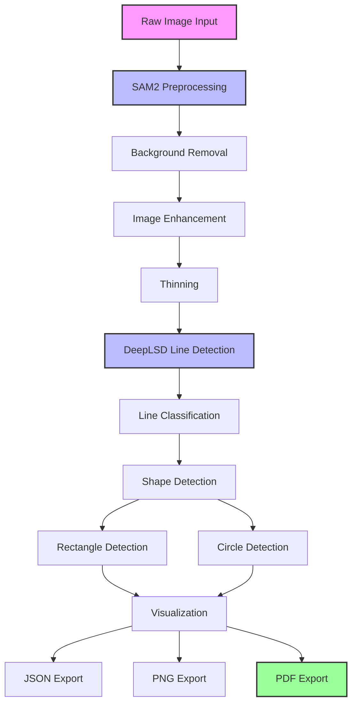
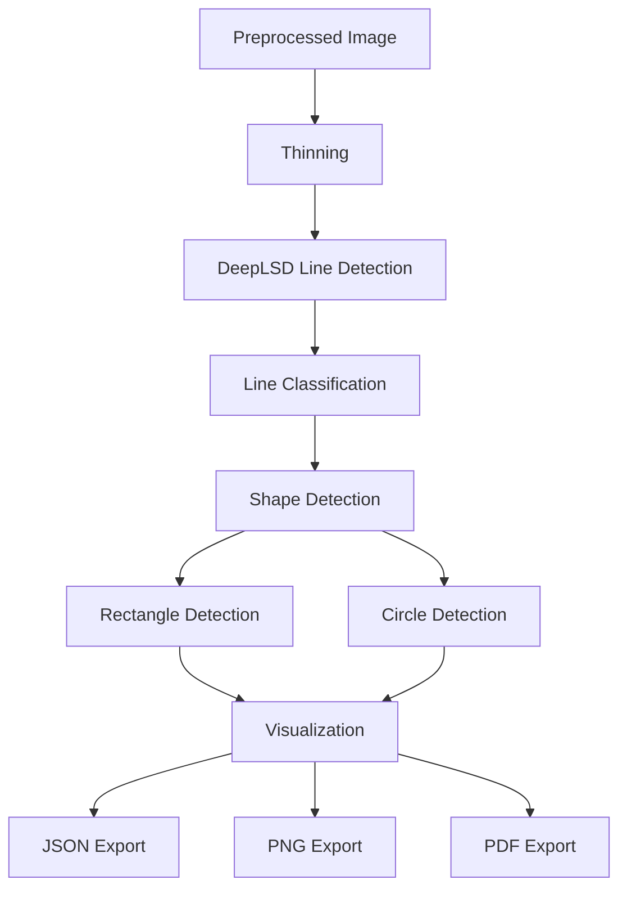

# Intelligent Sketch2CAD
====================

AI-assisted pipeline that converts hand-drawn sketches with dimensions into technical drawings and CAD models.

## 🏗️ Project Architecture

This project provides a complete pipeline for converting hand sketches to technical drawings, with support for multiple line detection methods and extensible architecture.

### 📁 Project Structure

```
Intelligent_Sketch2CAD/
├── 📓 notebooks/                    # Jupyter notebooks for development and testing
│   ├── 0_preprocessing_load_image.ipynb
│   ├── 1_extract_contours_*.ipynb
│   ├── 2_extract_deepLSD_*.ipynb
│   └── vertical_slice_0.ipynb
├── 📂 src/                          # Core pipeline modules
│   ├── full_sketch2cad_pipeline.py    # Complete pipeline with SAM2 + DeepLSD (recommended)
│   ├── alternative_detectors.py        # Alternative line detection methods (TODO)
│   └── __init__.py                    # Package initialization
├── 📂 models/                       # Model storage
├── 📂 streamlit_app/               # Web interface (TODO)
│   └── app.py                        # Streamlit UI stub
├── 📂 input_data/                   # Input sketches
│   └── raw_sketches/               # Raw sketch images
├── 📂 intermediate_data/             # Preprocessed images and intermediate results
├── 📂 output_data/                  # Generated technical drawings and JSON results
├── 📂 archive/                      # Archived files and test scripts
├── 📂 DeepLSD/                      # DeepLSD model and code
├── 📂 docs/                         # Documentation
├── 📂 config/                       # Configuration files
├── 📂 tests/                        # Unit tests
├── app.py                            # Main application entry
├── main.py                           # Alternative entry point
└── requirements.txt                   # Python dependencies
```

### 🔧 Core Pipeline Workflow

The project provides two main pipelines:

#### **Full Pipeline** (`src/full_sketch2cad_pipeline.py`) - Recommended
Complete automation from raw image to technical drawing with SAM2 preprocessing:



#### **Legacy Pipeline** (`src/sketch2cad_pipeline.py`) - For development
Basic pipeline without SAM2 preprocessing:



#### 1. **Image Preprocessing**
- Load and convert to grayscale
- Fix image polarity (dark/light adjustment)
- Contour-based filtering to remove noise
- Connected components analysis

#### 2. **Thinning**
- Apply Zhang-Suen thinning algorithm
- Convert lines to 1-pixel width
- Preserve connectivity

#### 3. **Line Detection** (DeepLSD)
- Load pre-trained DeepLSD model
- Detect line segments with confidence scoring
- Extract geometric properties (length, angle)

#### 4. **Line Classification**
- Classify lines into categories:
  - **Main lines**: Long horizontal/vertical structural lines
  - **Dimension lines**: Medium-length measurement lines
  - **Tick marks**: Short diagonal marks at 45°/135°
  - **Other**: Unclassified geometric elements
  - **Noise**: Very short segments

#### 5. **Shape Detection**
- **Rectangles**: Filter and combine main H/V lines
- **Circles**: Detect from skeletonized contours using circularity

#### 6. **Output Generation**
- JSON with all detected elements and metadata
- PNG visualization with color-coded elements
- PDF technical drawing (placeholder implementation)

### 🤖 Alternative Line Detection Methods

The project includes TODO stubs for alternative detection methods:

#### **PaddleOCR** (`src/alternative_detectors.py`)
- Extract text and geometric structures
- Useful for dimension annotations
- Multi-language support

#### **YOLOv8-seg**
- Semantic segmentation for geometric primitives
- Deep learning-based object detection
- Customizable for specific sketch types

#### **ScanLSD**
- Alternative line segment detector
- Different algorithmic approach
- Complementary to DeepLSD

#### **Hybrid Detector**
- Combine multiple methods
- Voting mechanism for robustness
- Confidence-weighted fusion

### 🌐 Web Interface (TODO)

Streamlit-based web interface (`streamlit_app/app.py`):

#### Features to Implement:
- **File Upload**: Drag-and-drop sketch upload
- **Configuration Panel**: Adjust detection parameters
- **Real-time Preview**: Live parameter adjustment
- **Results Display**: Interactive visualization
- **Download Options**: JSON, PNG, PDF exports
- **Batch Processing**: Multiple image support
- **Detector Comparison**: Side-by-side results

### 📊 Current Capabilities

#### ✅ **Working Features**
- DeepLSD line detection with pre-trained model
- Image preprocessing and thinning
- Line classification by geometry
- Rectangle and circle detection
- JSON and PNG output generation
- Mirror sketch processing (tested use case)

#### 🚧 **TODO Features**
- PDF technical drawing generation
- PaddleOCR integration
- YOLOv8-seg implementation
- ScanLSD alternative
- Streamlit web interface
- Hybrid detection methods
- Batch processing
- Parameter optimization
- Additional shape detection (arcs, ellipses)
- Dimension text extraction
- CAD model export (DXF/DWG)

## 🚀 Quick Start

### Installation

#### 1. Clone Repository
```bash
git clone https://github.com/tomaszbielNCI/Intelligent_Sketch2CAD.git
cd Intelligent_Sketch2CAD
```

#### 2. Create Virtual Environment
```bash
python -m venv .venv
source .venv/bin/activate  # Linux/Mac
.venv\Scripts\activate     # Windows
```

#### 3. Install Dependencies
```bash
pip install -r requirements.txt
```

#### 4. Setup DeepLSD (Required)
```bash
# DeepLSD is included as a git submodule
git submodule update --init --recursive

# Install DeepLSD dependencies
cd DeepLSD
pip install -r requirements.txt
cd ..

# Download DeepLSD model
# Place model at: DeepLSD/weights/deeplsd_md.tar
```

#### 5. Setup SAM2 (Optional but Recommended)
```bash
# Clone SAM2 repository
git clone https://github.com/facebookresearch/segment-anything-2.git

# Install SAM2
cd segment-anything-2
pip install -e .

# Download SAM2 model (small version recommended)
# Download from: https://github.com/facebookresearch/segment-anything-2/releases
# Place in project root:
# - sam2_hiera_small.pt
# - sam2_hiera_s.yaml
```

#### 6. Verify Installation
```bash
# Test DeepLSD model loading
python src/full_sketch2cad_pipeline.py --no-save
```

### Running Pipeline

#### **Full Automatic Pipeline (Recommended)**
```bash
# Process all images in input_data/raw_sketches/
python src/full_sketch2cad_pipeline.py

# Process specific image
python src/full_sketch2cad_pipeline.py --image "path/to/your/image.jpg"

# Test without saving
python src/full_sketch2cad_pipeline.py --no-save
```

#### **Legacy Pipeline**
```bash
# Process default image (latest in intermediate_data/)
python src/sketch2cad_pipeline.py

# Process specific image
python src/sketch2cad_pipeline.py --image path/to/sketch.jpg

# Custom project directory
python src/sketch2cad_pipeline.py --project-dir /path/to/project

# Process without saving files
python src/sketch2cad_pipeline.py --no-save
```

#### **Jupyter Notebooks:**
1. Open `notebooks/2_extract_deepLSD_v3.ipynb`
2. Run cells sequentially
3. Results saved to `intermediate_data/` and `outputs/`

#### **Web Interface (TODO):**
```bash
streamlit run streamlit_app/app.py
```

## 📁 Input/Output Formats

### **Input**
- **Location**: `input_data/raw_sketches/`
- **Formats**: PNG, JPG, JPEG, TIFF, BMP
- **Recommended**: Clean hand sketches with good contrast
- **Size**: Any size (automatically processed)

### **Output**
- **Location**: `output_data/`
- **JSON**: Complete detection data with metadata
- **PNG**: Visualization with color-coded elements
- **PDF**: Technical drawing (TODO)
- **DXF**: CAD format (TODO)

### **JSON Structure**
```json
{
  "timestamp": "20260511_143013",
  "source_image": "path/to/image.jpg",
  "image_size": {"height": 1200, "width": 800},
  "method": "DeepLSD v6 - filtered H/V + contour circles",
  "rectangles": [
    {
      "label": "outer",
      "x1": 100, "y1": 200, "x2": 600, "y2": 800,
      "width_px": 500, "height_px": 600
    }
  ],
  "circles": [
    {
      "label": "mounting_1",
      "cx": 200, "cy": 300, "radius_px": 25,
      "radius_mm": null, "circularity": 0.85
    }
  ],
  "lines": {
    "main": [...],
    "dimension_lines": [...],
    "ticks": [...]
  },
  "statistics": {
    "deeplsd_raw": 344,
    "main": 54,
    "dimension": 38,
    "ticks": 53,
    "circles_mounting": 4
  },
  "notes": {
    "scale_hint": "857mm = external width"
  }
}
```

## 🔬 Development

### **Notebooks Development**
- Use `notebooks/` for experimentation
- `2_extract_deepLSD_v3.ipynb` is the current reference implementation
- `vertical_slice_0.ipynb` for end-to-end testing

### **Code Structure**
- **Core pipeline**: `src/sketch2cad_pipeline.py`
- **Alternative methods**: `src/alternative_detectors.py`
- **Configuration**: `config/` directory
- **Tests**: `tests/` directory

### **Adding New Detectors**
1. Inherit from `LineDetector` in `alternative_detectors.py`
2. Implement `detect_lines()` and `load_model()` methods
3. Add to `create_detector()` factory function
4. Update pipeline to support new detector

### **Testing**
```bash
# Run unit tests
python -m pytest tests/

# Run specific notebook
jupyter notebook notebooks/2_extract_deepLSD_v3.ipynb
```

## 🎯 Use Cases

### **Current: Mirror Sketches**
- Successfully processes hand-drawn mirror designs
- Extracts rectangular frames and mounting holes
- Generates technical drawings with dimensions

### **Target Applications**
- **Construction**: Window/door sketches
- **Manufacturing**: Part design sketches
- **Architecture**: Floor plan sketches
- **Engineering**: Technical diagrams

## 🤝 Contributing

1. **Fork** repository
2. **Create** feature branch
3. **Implement** changes with tests
4. **Document** new features
5. **Submit** pull request

### **Development Guidelines**
- Follow PEP 8 style
- Add type hints for new functions
- Include docstrings with examples
- Update README for new features
- Test with sample sketches

## 📄 License

This project is licensed under MIT License - see LICENSE file for details.

## 🙏 Acknowledgments

- **DeepLSD**: Line segment detection model
- **OpenCV**: Computer vision operations
- **PyTorch**: Deep learning framework
- **Streamlit**: Web interface framework
- **Matplotlib**: Visualization

## 📞 Contact

For questions, issues, or contributions:
- **GitHub**: [tomaszbielNCI/Intelligent_Sketch2CAD](https://github.com/tomaszbielNCI/Intelligent_Sketch2CAD)
- **Issues**: [GitHub Issues](https://github.com/tomaszbielNCI/Intelligent_Sketch2CAD/issues)

---

**Note**: This is an active research project. Some features are in development (marked as TODO). The core pipeline is functional for mirror sketch processing.
