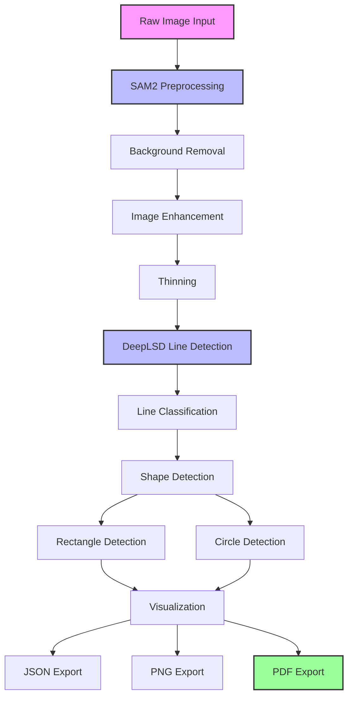

# Intelligent Sketch2CAD

**Vertical Slice** – Converts hand-drawn technical sketches into professional technical drawings (PDF, DXF) compatible with **FreeCAD** for glass construction and fitting (windows, doors, mirrors).

## 🎯 Real-World Application

This project solves a real business problem for a glass construction and fitting company (windows, doors, mirrors). Instead of outsourcing technical drawings or spending hours in AutoCAD, the owner can now:
1. Take a photo of a hand-drawn sketch
2. Run the pipeline
3. Get a ready-to-use technical drawing (PDF/DXF) with dimensions, mounting holes, and title block
4. Open directly in **FreeCAD** for further editing or CAM export

**Tested use case**: Bathroom mirror – 857×660 mm with 4 mounting holes (⌀36 mm)

## 🔧 Pipeline Workflow

Raw Sketch → SAM2 (background removal) → Adaptive Threshold → Component Filtering → Thinning → DeepLSD (line detection) → Classification → Rectangle & Circle Detection → Calibration (px → mm) → Technical Drawing (PDF/DXF) → FreeCAD

## 🏗️ Project Architecture

This project provides a complete pipeline for converting hand sketches to technical drawings, with support for multiple line detection methods and extensible architecture.


### 🔧 Core Pipeline Workflow

The project provides two main pipelines:

#### **Full Pipeline** (`src/full_sketch2cad_pipeline.py`) - Recommended
Complete automation from raw image to technical drawing with SAM2 preprocessing:



## 🚀 Quick Start

### Installation

```bash
# Clone repository
git clone https://github.com/tomaszbielNCI/Intelligent_Sketch2CAD.git
cd Intelligent_Sketch2CAD

# Create virtual environment
python -m venv .venv
.venv\Scripts\activate  # Windows

# Install dependencies
pip install -r requirements.txt

# Download SAM2 model (place in project root)
# - sam2_hiera_small.pt
# - sam2_hiera_s.yaml

# DeepLSD model should be at: DeepLSD/weights/deeplsd_md.tar
```

### Run Pipeline

```bash
# Process default image (input_data/raw_sketches/WhatsApp Image 2026-04-24 at 21.41.48.jpeg)
python src/full_sketch2cad_pipeline.py

# Process specific image
python src/full_sketch2cad_pipeline.py --image "path/to/your/sketch.jpg"

# Test without saving files
python src/full_sketch2cad_pipeline.py --no-save
```

## 📁 Input / Output

| Type | Location | Format |
|------|----------|--------|
| Input sketches | `input_data/raw_sketches/` | JPG, PNG, JPEG |
| Output JSON | `output_data/full_pipeline_*.json` | Detection data |
| Output PNG | `output_data/technical_drawing_*.png` | Color-coded visualization |
| Output PDF | `output_data/technical_drawing_*.pdf` | Professional technical drawing |
| Output DXF | `output_data/sketch_*.dxf` | CAD format (FreeCAD compatible) |

## 🖼️ Technical Drawing Output

The pipeline generates a professional technical drawing fully compatible with **FreeCAD**:
- Main rectangle in real dimensions (calibrated from sketch)
- Mounting holes with crosshairs
- Dimension lines (width, height, hole spacing, edge offsets)
- Hole diameter annotation
- Title block (glass type, thickness, project info, date)

**FreeCAD compatibility:**
- **DXF export** – can be opened directly in FreeCAD's Draft Workbench
- **PDF output** – ready for printing or sharing with clients
- **JSON data** – can be used to generate parametric FreeCAD models via Python script

**Calibration**: Based on known dimensions (default: 857×660 mm) – can be modified in code.

## 🏗️ Project Structure (Active Files Only)

```
Intelligent_Sketch2CAD/
├── src/
│   └── full_sketch2cad_pipeline.py   # MAIN PIPELINE (working)
├── input_data/raw_sketches/          # Place sketches here
├── output_data/                      # Results (JSON, PNG, PDF, DXF)
├── intermediate_data/                # Temporary files
├── DeepLSD/                          # Line detection model
├── notebooks/                        # Development experiments
└── requirements.txt                  # Dependencies
```

## 🧪 Tested On

Hand-drawn mirror sketch for glass construction (bathroom mirror)
- Dimensions: 857×660 mm
- 4 mounting holes (⌀36 mm)
- White background, black lines
- Successfully imported to FreeCAD for validation

## 🛠️ Use with FreeCAD

After running the pipeline, you can:

**Open DXF directly in FreeCAD:**
1. Launch FreeCAD
2. File → Open → Select `sketch_*.dxf` from `output_data/`
3. Switch to Draft Workbench for editing

**Generate parametric model from JSON:**
- Use included JSON data to create a scripted FreeCAD model
- Modify dimensions programmatically

**Print PDF for client approval:**
- The PDF contains all dimensions and specifications
- Ready for glass order submission

## ⚠️ Current Limitations

- Requires good contrast sketch (white background, dark lines)
- SAM2 model files must be downloaded manually
- Real dimensions are hardcoded (857×660 mm) – can be changed in `full_sketch2cad_pipeline.py`
- Works best for rectangular glass elements (mirrors, window panes, door glass) with circular mounting holes

## 🔬 Technologies

| Component | Technology |
|-----------|------------|
| Background removal | SAM2 (Meta) |
| Line detection | DeepLSD |
| Image processing | OpenCV |
| Thinning | Zhang-Suen algorithm |
| Technical drawing | Matplotlib |
| DXF export | ezdxf |
| CAD compatibility | FreeCAD (DXF import) |

## 📚 Academic Context

This project was developed for **Intelligent Agents and Process Automation** module at National College of Ireland.

Automation type demonstrated:
- **AI/Agentic automation**: DeepLSD + SAM2 for intelligent line detection
- **RDA-based automation proposal** procesing batch files without human in loop

## 📄 License

MIT License – see LICENSE file for details.

## 👤 Author

Tomasz Biel – Postgraduate in Science in Artificial Intelligence

**Status**: ✅ Vertical slice complete – from raw sketch to professional technical drawing (PDF/DXF), fully compatible with **FreeCAD** – ready for glass fitting orders
